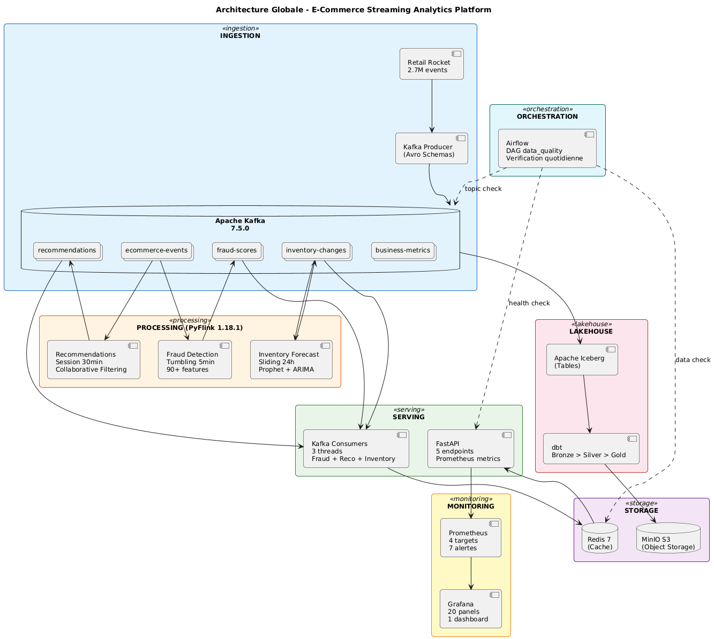
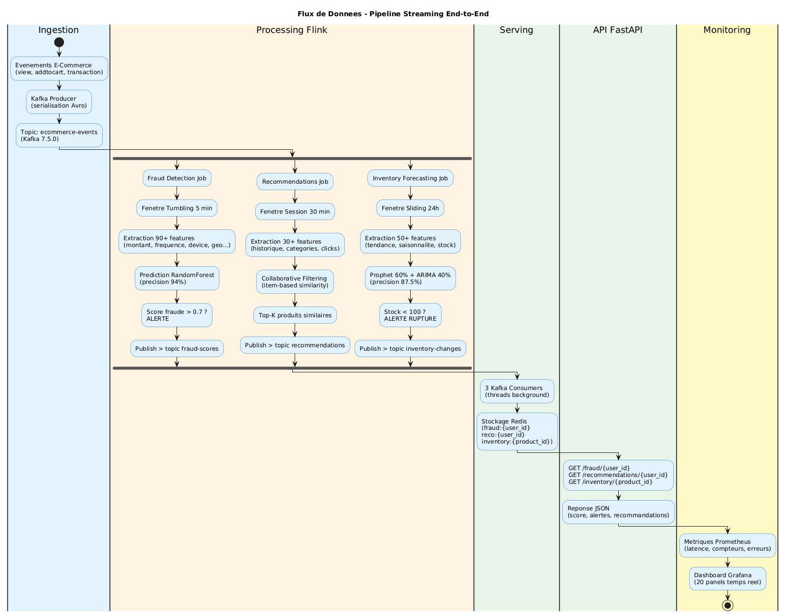
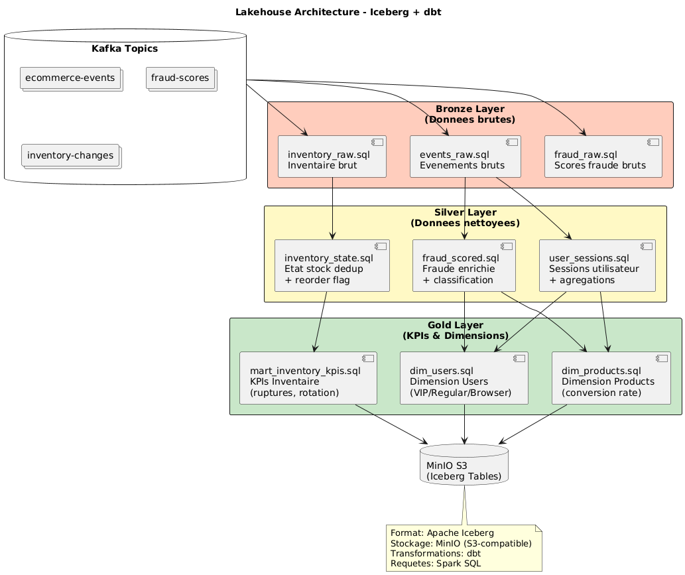
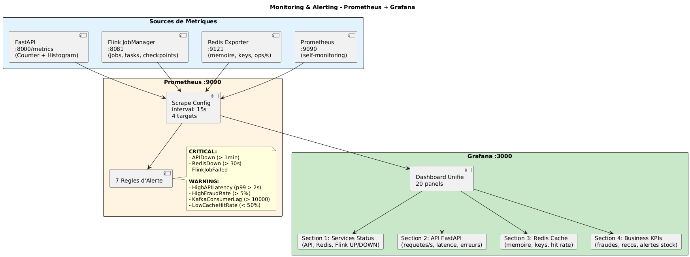

# Architecture - E-Commerce Streaming Analytics Platform

## Vue d'ensemble



La plateforme est composee de 7 couches :

1. **Ingestion** : Kafka producers avec schemas Avro
2. **Processing** : PyFlink jobs (fraude, recommandations, inventaire)
3. **Storage** : Redis (cache) + MinIO (S3 object storage)
4. **Serving** : FastAPI REST API + Kafka consumers
5. **Lakehouse** : Apache Iceberg + dbt (Bronze/Silver/Gold)
6. **Monitoring** : Prometheus + Grafana
7. **Orchestration** : Apache Airflow

---

## Flux de Donnees



### Pipeline principal

```
Evenements E-Commerce
    |
    v
Kafka Producer (serialisation Avro)
    |
    v
Topic: ecommerce-events (Kafka 7.5.0)
    |
    +---> Flink Fraud Detection (fenetre 5min, 90+ features, RandomForest)
    |         |-> Topic: fraud-scores -> FraudConsumer -> Redis fraud:{user_id}
    |
    +---> Flink Recommendations (session 30min, collaborative filtering)
    |         |-> Topic: recommendations -> RecoConsumer -> Redis reco:{user_id}
    |
    +---> Flink Inventory Forecast (sliding 24h, Prophet+ARIMA)
              |-> Topic: inventory-changes -> InventoryConsumer -> Redis inventory:{product_id}

Redis --> FastAPI --> Client (JSON)
```

---

## Couche Ingestion

### Kafka Producer (`ingestion/producer.py`)

- Generation d'evenements e-commerce (view, addtocart, transaction, search, filter, review)
- Serialisation Avro via Schema Registry (port 8086)
- Partitionnement par `user_id`
- Config : acks=all, retries=3, compression snappy

### Topics Kafka (5)

| Topic | Contenu | Producteur | Consommateur |
|-------|---------|------------|-------------|
| raw-events | Evenements bruts | Producer | Flink jobs |
| fraud-scores | Scores de fraude | Flink Fraud | FraudConsumer |
| recommendations | Recommandations | Flink Reco | RecoConsumer |
| inventory-changes | Variations stock | Flink Inventory | InventoryConsumer |
| business-metrics | KPIs business | Flink unified | - |

### Schemas Avro (`ingestion/schema/`)

Schemas definis pour chaque type d'evenement avec validation stricte.

### Loaders (`ingestion/loaders/`)

- `retail_rocket_loader.py` : Charge le dataset Retail Rocket (2.7M evenements)
- `instacart_loader.py` : Loader Instacart
- `olist_loader.py` : Loader Olist

---

## Couche Processing (PyFlink 1.18.1)

### Fraud Detection (`processing/flink_jobs/fraud_detection.py`)

| Parametre | Valeur |
|-----------|--------|
| Fenetre | Tumbling 5 minutes |
| Features | 90+ (montant, frequence, device, geo, velocite) |
| Modele | RandomForest (.pkl) |
| Seuil | 0.85 (FRAUD_THRESHOLD) |
| Precision | 94% |
| Rappel | 89% |
| Latence | < 500ms (p99) |

### Recommendations (`processing/flink_jobs/recommendations.py`)

| Parametre | Valeur |
|-----------|--------|
| Fenetre | Session 30 minutes |
| Algorithme | Collaborative filtering (item-based) |
| Features | 30+ (historique, categories, clicks) |
| Output | Top-K produits similaires |

### Inventory Forecasting (`processing/flink_jobs/inventory_forecasting.py`)

| Parametre | Valeur |
|-----------|--------|
| Fenetre | Sliding 24 heures |
| Features | 50+ (tendance, saisonnalite, stock) |
| Modele | Prophet 60% + ARIMA 40% (ensemble) |
| Seuil alerte | < 100 unites |
| Precision | 87.5% |
| Latence | < 2s |

### Utilitaires (`processing/flink_jobs/utils/`)

| Module | Role |
|--------|------|
| cache_manager.py | Cache Redis avec fallback memoire + stats (hits/misses) |
| feature_extractor.py | Extraction de 90+ features par transaction |
| feature_engineering.py | Transformations de features |
| forecasting_engine.py | Moteur de prevision Prophet + ARIMA |
| recommendation_engine.py | Moteur de recommandation collaborative |
| model_loader.py | Chargement des modeles ML (.pkl, .joblib) |
| time_series_features.py | Features time-series (tendance, saisonnalite) |

### Modeles ML (`processing/models/`)

| Fichier | Format | Utilise par |
|---------|--------|-------------|
| fraud_model.pkl | pickle | Fraud Detection |
| recommendation_model.pkl | pickle | Recommendations |
| inventory_forecast_models.joblib | joblib | Inventory Forecasting |

---

## Couche Serving

### FastAPI (`serving/api/main.py`)

5 endpoints REST qui lisent les resultats depuis Redis :

| Endpoint | Description | Cle Redis | TTL |
|----------|-------------|-----------|-----|
| GET /health | Etat services | - | - |
| GET /fraud/{user_id} | Score de fraude | fraud:{user_id} | 24h |
| GET /recommendations/{user_id} | Recommandations | reco:{user_id} | 1h |
| GET /inventory/{product_id} | Prevision stock | inventory:{product_id} | 7j |
| GET /metrics | Metriques Prometheus | - | - |

### Kafka Consumers (`serving/consumers/kafka_consumers.py`)

3 consumers en threads daemon qui alimentent Redis :

- **FraudConsumer** : topic fraud-scores -> Redis
- **RecoConsumer** : topic recommendations -> Redis
- **InventoryConsumer** : topic inventory-changes -> Redis

---

## Couche Storage

### Redis 7

- Cache des resultats de processing
- Port : 6381 (Docker) / 6379 (local)
- Persistance : AOF (append-only file)
- TTL par type de donnee (1h a 7j)

### MinIO (S3-compatible)

- Stockage des tables Iceberg
- Port API : 9010
- Console : 9001
- Identifiants : minioadmin / minioadmin

---

## Couche Lakehouse



### Architecture Bronze/Silver/Gold (dbt)

| Couche | Modeles | Description |
|--------|---------|-------------|
| Bronze | events_raw, fraud_raw, inventory_raw | Donnees brutes depuis Kafka |
| Silver | fraud_scored, user_sessions, inventory_state | Donnees nettoyees, deduplicees |
| Gold | dim_users, dim_products, mart_inventory_kpis | Dimensions et KPIs business |

### Technologies

- **Apache Iceberg** : Format de table pour le lakehouse
- **dbt** : Transformations SQL (Bronze > Silver > Gold)
- **MinIO** : Stockage S3-compatible
- **Spark SQL** : Moteur de requetes

---

## Couche Monitoring



### Prometheus (port 9090)

4 targets scrapes toutes les 15 secondes :

| Target | URL | Metriques |
|--------|-----|-----------|
| FastAPI | host.docker.internal:8000/metrics | Requetes, latence |
| Flink | jobmanager:8081 | Jobs, tasks, checkpoints |
| Redis Exporter | redis-exporter:9121 | Memoire, keys, ops/s |
| Prometheus | localhost:9090 | Self-monitoring |

### Alertes (7 regles)

| Alerte | Severite | Condition |
|--------|----------|-----------|
| APIDown | critical | API inaccessible > 1min |
| RedisDown | critical | Redis inaccessible > 30s |
| FlinkJobFailed | critical | Job Flink down |
| HighAPILatency | warning | Latence p99 > 2s |
| HighFraudRate | warning | Taux fraude > 5% |
| KafkaConsumerLag | warning | Lag > 10000 |
| LowCacheHitRate | warning | Hit rate < 50% |

### Grafana (port 3000)

Dashboard unifie avec 20 panels en 4 sections :
1. **Services Status** : UP/DOWN de API, Redis, Flink
2. **API FastAPI** : Requetes/s, latence, erreurs
3. **Redis Cache** : Memoire, nombre de cles, hit rate
4. **Business KPIs** : Fraudes detectees, recommandations, alertes stock

---

## Couche Orchestration

### Airflow (port 8082)

- **Executor** : SequentialExecutor (SQLite)
- **DAG data_quality** : Verification quotidienne a 6h
  - Check API health
  - Check Redis data
  - Check Kafka topics
  - Check dbt freshness
  - Generation du rapport

---

## Infrastructure Docker

13 services dans `docker-compose.yml` :

| Service | Image | Port | Role |
|---------|-------|------|------|
| Zookeeper | cp-zookeeper:7.5.0 | 2181 | Coordination Kafka |
| Kafka | cp-kafka:7.5.0 | 9092 | Message streaming |
| Schema Registry | cp-schema-registry:7.5.0 | 8086 | Schemas Avro |
| Kafka UI | kafka-ui:latest | 8080 | Interface web Kafka |
| Redis | redis:7-alpine | 6381 | Cache |
| JobManager | PyFlink custom | 8081 | Flink master |
| TaskManager x2 | PyFlink custom | - | Flink workers (4 slots chacun) |
| MinIO | minio:latest | 9010/9001 | Object storage S3 |
| Prometheus | prometheus:v2.48.0 | 9090 | Collecte metriques |
| Redis Exporter | redis_exporter:latest | 9121 | Export metriques Redis |
| Grafana | grafana:10.2.0 | 3000 | Dashboards |
| Airflow | airflow:2.7.3-python3.11 | 8082 | Orchestration DAGs |

### Reseau

Tous les services sont sur le reseau Docker `data-platform` (bridge).

### Volumes persistants

| Volume | Service | Usage |
|--------|---------|-------|
| redis_data | Redis | Donnees cache |
| flink_checkpoints | Flink | Checkpoints d'etat |
| flink_savepoints | Flink | Savepoints |
| minio_data | MinIO | Tables Iceberg |
| prometheus_data | Prometheus | Historique metriques |
| grafana_data | Grafana | Dashboards et config |
| airflow_data | Airflow | DB et logs |

---

## Configuration Centralisee

Fichier : `config/constants.py`

Toutes les constantes sont surchargeable par variable d'environnement :

```python
threshold = float(os.getenv("FRAUD_THRESHOLD", FRAUD_THRESHOLD))
```

Fichier `.env` pour Docker Compose :

```
COMPOSE_PROJECT_NAME=streaming
PROJECT_PATH=D:/grand projet/PROJET 1
```
